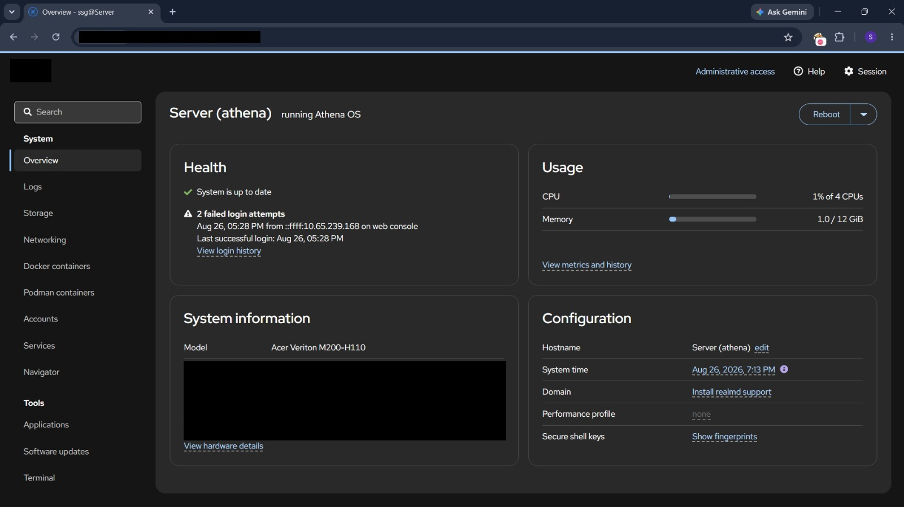
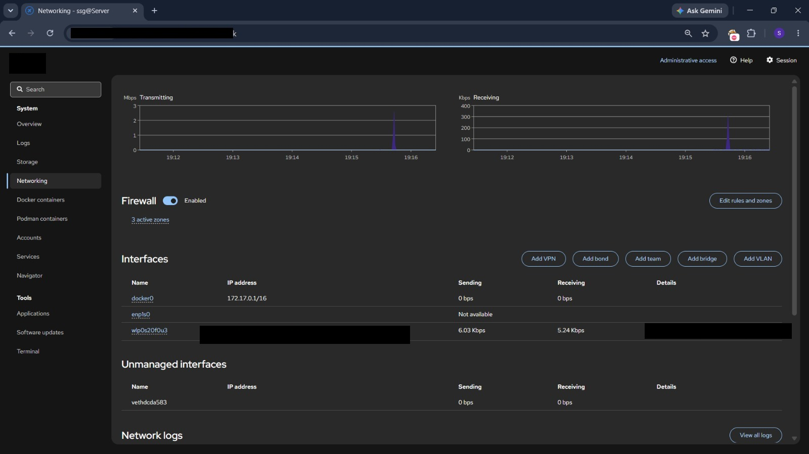
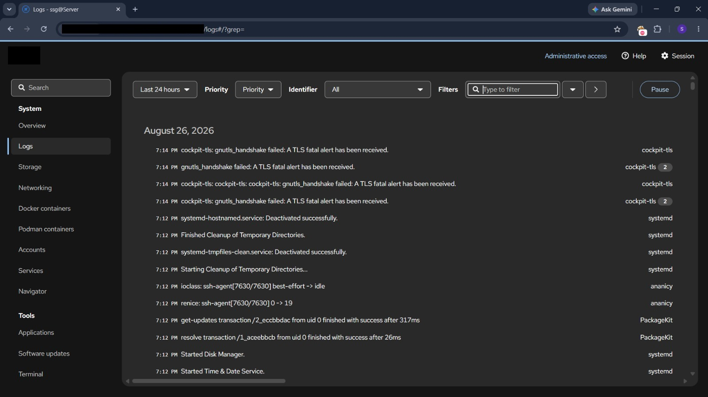
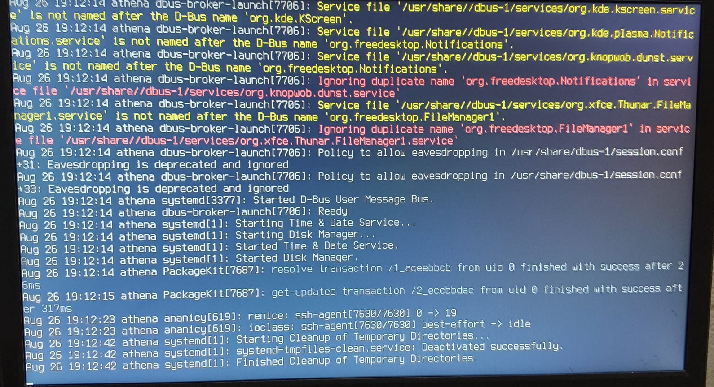
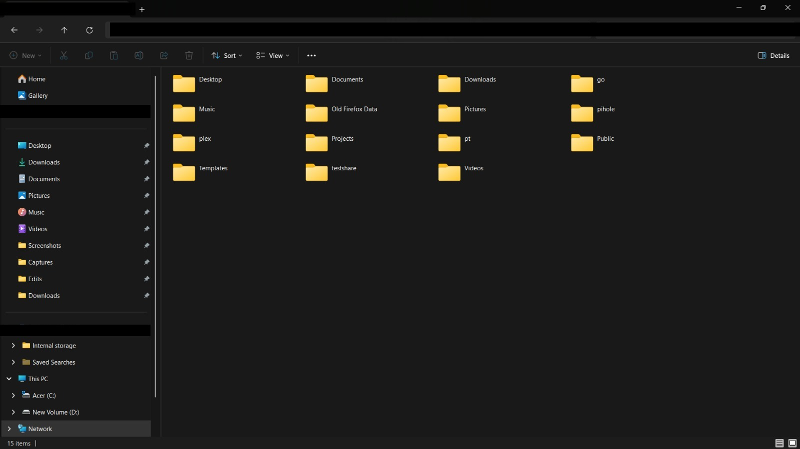
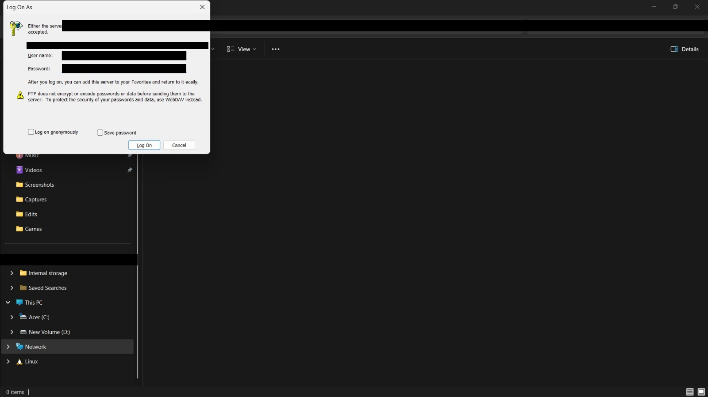

<div align="center">

<pre>
███████╗███████╗ ██████╗    ██╗      █████╗ ██████╗
 ██╔════╝██╔════╝██╔════╝    ██║     ██╔══██╗██╔══██╗
 ███████╗█████╗  ██║         ██║     ███████║██████╔╝
 ╚════██║██╔══╝  ██║         ██║     ██╔══██║██╔══██╗
 ███████║███████╗╚██████╗    ███████╗██║  ██║██████╔╝
 ╚══════╝╚══════╝ ╚═════╝    ╚══════╝╚═╝  ╚═╝╚═════╝
</pre>

# 🛡️ Linux Security Homelab

> *A self-hosted Linux server, configured and hardened from the ground up — not a tutorial clone, but a real box I run, break, monitor, and fix.*

<br>

[](https://athenaos.org)
[]()
[]()
[]()
[]()
[]()
[]()

</div>

---

## 📖 Overview

<div align="center">

|  |  |
|---|---|
| **OS** | Athena OS (Arch-based), Linux 7.0.12 |
| **Hardware** | Acer Veriton M200-H110, Intel i3-6100T, 12 GB RAM |
| **Access** | SSH (key-based), Cockpit web console |
| **Core services** | Firewalld, Docker, Cockpit, SSH, centralized logging |
| **Hosted apps** | Pi-hole, Plex, custom project containers |

</div>

The box is administered two ways: **SSH** from the terminal for day-to-day work, and **Cockpit** (web console, port 9090) for monitoring, log review, and network configuration at a glance.

<div align="center">



</div>

---

## 🗺️ Project Architecture

```
                        ┌──────────────────────────────────┐
                        │        🖥️  Athena OS Server      │
                        │                                  │
          Browser ────► │  🌐 Cockpit Web UI  (Port 9090)  │
                        │                                  │
          SSH ────────► │  🔑 SSH Daemon      (key-only)   │
                        │                                  │
                        │  🐳 Docker (bridge: docker0)      │
                        │     ├─ Pi-hole                   │
                        │     ├─ Plex                      │
                        │     └─ project containers        │
                        │                                  │
                        │  📋 Centralized Logging          │
                        │     ├─ journalctl -f             │
                        │     └─ Cockpit log viewer        │
                        │                                  │
                        │  ════════════════════════════    │
                        │  🔥 FIREWALLD  (3 active zones)  │
                        │     └─ granular, per-interface   │
                        └──────────────────────────────────┘
```

---

## 🎯 Key Areas of Work

### 🔥 1. Firewall

Firewalld runs with **3 active zones**, giving granular control over what's reachable and from where — rather than one flat set of rules for every interface.

<div align="center">



</div>

---

### 🔐 2. Access Control

- **SSH access is key-based** — password auth is disabled for remote login
- **User permissions are scoped per-service** — containerized apps (Pi-hole, Plex) run under their own accounts, not root, limiting blast radius if any one service is compromised
- **Failed login attempts are visible directly on the Cockpit dashboard**, so unusual access attempts don't go unnoticed

---

### 📊 3. Logging & Monitoring

All system logs are centralized and filterable through Cockpit — by priority, service, or time range — instead of digging through raw log files over SSH for every check.

<div align="center">



</div>

Live logs are also tailed directly via `journalctl -f` to catch misconfigurations early (e.g. duplicate D-Bus service names, deprecated policies) rather than letting warnings go unread.

<div align="center">



</div>

---

### 🐳 4. Isolation

Docker handles containerized services on their own bridge network (`docker0`, `172.17.0.1/16`), separating application traffic from the host's LAN-facing interface.

---

### 🗂️ 5. Server Layout

Standard structure kept clean and predictable — home directory, a dedicated `Projects` folder for work in progress, and separate root-owned directories for long-running services (`pihole`, `plex`) to keep service data isolated from user data.

<div align="center">



</div>

Remote file access is available over FTP for quick transfers — though as Windows itself warns, FTP is unencrypted, so this is being migrated to **WebDAV/SFTP-only** access.

<div align="center">



</div>

---

## 🔐 Security Principles Applied

```
┌─────────────────────────────────────────────────────────┐
│                  SECURITY PRINCIPLES                    │
├──────────────────────┬──────────────────────────────────┤
│  Least Privilege     │  Services run under their own    │
│                      │  accounts, never root             │
├──────────────────────┼──────────────────────────────────┤
│  Zone-Based Firewall │  3 firewalld zones instead of     │
│                      │  one flat rule set                │
├──────────────────────┼──────────────────────────────────┤
│  Visibility          │  Centralized logs + live tailing  │
│                      │  to catch issues early            │
├──────────────────────┼──────────────────────────────────┤
│  Network Isolation   │  Docker bridge network keeps      │
│                      │  app traffic off the LAN iface    │
├──────────────────────┼──────────────────────────────────┤
│  Encrypted Access    │  Key-based SSH; FTP being retired │
│                      │  in favor of WebDAV/SFTP          │
└──────────────────────┴──────────────────────────────────┘
```

---

## 📚 What This Project Is For

This lab exists to practice things that don't show up in tutorials:

- Actually hardening a box, not just installing software on top of defaults
- Reading logs and boot output critically instead of ignoring warnings
- Structuring firewall zones and container isolation with intent
- Documenting a real system the way it'd need to be documented on a real job

---

## ✅ Skills Demonstrated

```
 🐧  Linux system administration on a real Arch-based machine
 🔥  Zone-based firewall configuration with Firewalld
 🔐  Key-based SSH access control and per-service permissions
 📊  Centralized log monitoring and live journalctl tailing
 🐳  Docker container isolation via dedicated bridge network
 🌐  Web-based server administration via Cockpit
 🗂️  Clean, predictable server/file layout
 🛡️  Security hardening and blue-team thinking
```

---

<div align="center">

---

*Part of my broader cybersecurity portfolio — see [profile README](https://github.com/SSG-143) for other projects.*

[](https://athenaos.org)
[]()
[]()

</div>
